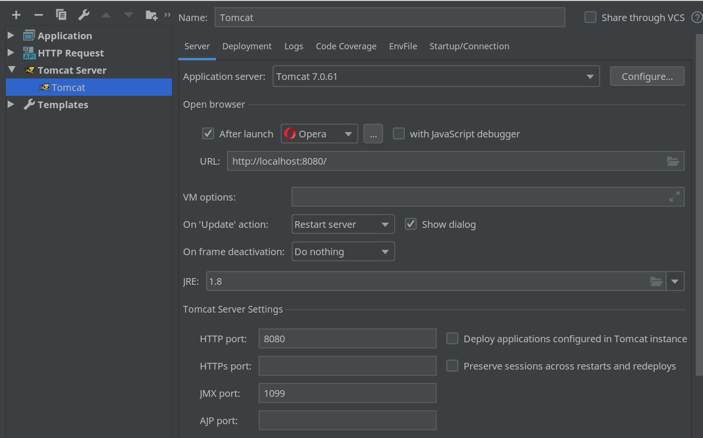

### Instructions
#### For running you  need to configure Apache Tomcat:

 
#### Navigate to following application URLs for Eclipse IDE:

    http://localhost:8080/messenger-app/
    
For access resources for Intellij:    
        
    http://localhost:8080/webapi/myresource
        
For access message info by Id:
         
    http://localhost:8080/webapi/messages/1
         
For extracting all messages by specified year (use current year):
    
    http://localhost:8080/webapi/messages?year=2020
         
For extracting all messages by specified pagination:
    
    http://localhost:8080/webapi/messages?start=1&size=1
         
For matrix param use next url (add to header value - customHeaderValue => test header value):
    
    http://localhost:8080/webapi/injectdemo/annotations;param=value
         
For access context param:
    
    http://localhost:8080/webapi/injectdemo/context
         
For access message comment by id, just use:
    
    http://localhost:8080/webapi/messages/2/comments/2
    
POST new comment for message (with header and body):

    http://localhost:8080/webapi/messages/1/comments
    Content-Type: application/json
    
    {
      "id" : 1,
      "message" : "1 comment",
      "created" : 1570913749583,
      "author" : "lelyak"
    }        
     
##### If you are Intellij user configure only `http://localhost:8080/` 
This will be enough.  
Use `Postman` browser extension for checking response.
      